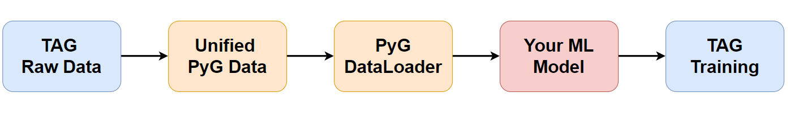

<p align='center'>
  
</p>

## Why TEGs instead of TAGs? 🤔

Textual-Edge Graphs (TEGs) incorporate textual content on **both nodes and edges**, unlike Text-Attributed Graphs (TAGs) featuring textual information **only at the nodes**. **Edge texts are crucial for understanding document meanings and semantic relationships.** For instance, as shown below, to understand the knowledge "Planck endorsed the uncertainty and probabilistic nature of quantum mechanics," **citation edge (Book D - Paper E) text information is essential**. This reveals the comprehensive connections and influences among scholarly works, enabling a deeper analysis of document semantics and knowledge networks.


## Overview 📚

Textual-Edge Graphs Datasets and Benchmark (TEG-DB) is a comprehensive and diverse collection of benchmark textual-edge datasets featuring rich textual descriptions on nodes and edges, data loaders, and performance benchmarks for various baseline models,  including pre-trained language models (PLMs), graph neural networks (GNNs), and their combinations. This repository aims to facilitate research in the domain of textual-edge graphs by providing standardized data formats and easy-to-use tools for model evaluation and comparison.

## Features ✨

+ **Unified Data Representation:** All TEG datasets are represented in a unified format. This standardization allows for easy extension of new datasets into our benchmark.
+ **Highly Efficient Pipeline:** TEG-Benchmark is highly integrated with PyTorch Geometric (PyG), leveraging its powerful tools and functionalities. Therefore, its code is concise. Specifically, for each paradigm, we provide a small `.py` file with a summary of all relevant models and a `.ssh` file  to run all baselines in one click.
+ **Comprehensive Benchmark and Analysis:** We conduct extensive benchmark experiments and perform a comprehensive analysis of TEG-based methods, delving deep into various aspects such as the impact of different models, the effect of embeddings generated by Pre-trained Language Models (PLMs) of various scales, and the influence of different domain datasets. The statistics of our TEG datasets are as follows:

<p align='center'>
  
</p>

## Datasets 📊

Please click [Huggingface TEG-Benchmark](https://huggingface.co/datasets/ZhuofengLi/TEG-Datasets) to  find the TEG datasets we upload!

We have constructed **10 comprehensive and representative TEG datasets (we will continue to expand)**. These datasets cover domains including Book Recommendation, E-commerce, Academic, and Social networks. They vary in size, ranging from small to large. Each dataset contains rich raw text data on both nodes and edges, providing a diverse range of information for analysis and modeling purposes.

| Dataset            | Nodes     | Edges      | Graph Domain        | Node Classification | Link Prediction  | Details                             |
|--------------------|-----------|------------|---------------------|---------------------|------------------|-------------------------------------|
| Goodreads-History   | 540,796   | 2,066,193  | Book Recommendation  | ✅                   | ✅                | [Link](https://huggingface.co/datasets/ZhuofengLi/TEG-Datasets/blob/main/goodreads_history/goodreads.md) |
| Goodreads-Crime     | 422,642   | 1,849,236  | Book Recommendation  | ✅                   | ✅                | [Link](https://huggingface.co/datasets/ZhuofengLi/TEG-Datasets/blob/main/goodreads_crime/goodreads.md)   |
| Goodreads-Children  | 216,613   | 734,640    | Book Recommendation  | ✅                   | ✅                | [Link](https://huggingface.co/datasets/ZhuofengLi/TEG-Datasets/blob/main/goodreads_children/goodreads.md) |
| Goodreads-Comics    | 148,658   | 542,338    | Book Recommendation  | ✅                   | ✅                | [Link](https://huggingface.co/datasets/ZhuofengLi/TEG-Datasets/blob/main/goodreads_comics/goodreads.md)   |
| Amazon-Movie        | 174,012   | 1,697,533  | E-commerce          | ✅                   | ✅                | [Link](https://huggingface.co/datasets/ZhuofengLi/TEG-Datasets/blob/main/amazon_movie/movie.md)       |
| Amazon-Apps         |    100,480       |     752,937       | E-commerce          | ✅                   | ✅                | [Link](https://huggingface.co/datasets/ZhuofengLi/TEG-Datasets/blob/main/amazon_apps/apps.md)        |
| Amazon-Baby         | 186,790   | 1,241,083  | E-commerce          | ✅                   | ✅                | [Link](https://huggingface.co/datasets/ZhuofengLi/TEG-Datasets/blob/main/amazon_baby/baby.md)        |
| Reddit              | 512,776   | 256,388    | Social Networks     | ✅                   | ✅                | [Link](https://huggingface.co/datasets/ZhuofengLi/TEG-Datasets/blob/main/reddit/reddit.md)             |
| Twitter             | 60,785    | 74,666     | Social Networks     | ✅                    | ✅                | [Link](https://huggingface.co/datasets/ZhuofengLi/TEG-Datasets/blob/main/twitter/twitter.md)            |
| Citation            |   169,343        |    1,166,243        | Academic            | ✅                   | ✅                | [Link](https://huggingface.co/datasets/ZhuofengLi/TEG-Datasets/blob/main/arxiv/arxiv.md)           |


**TEG-DB is an ongoing effort, and we are planning to increase our coverage in the future.**

## Our Experiments 🔬

Please check the experimental results and analysis from our [paper](https://arxiv.org/abs/2406.10310).

## Package Usage ⚙️
### Requirements 📋
You can quickly install the corresponding dependencies,

```bash
pip install -r requirements.txt
```

### More details about packages 📦

The `GNN` folder is intended to house all GNN methods for link prediction and node classification (Please click [here](GNN/readme.md) to see more training details). The `data_preprocess` folder contains various scripts for generating TEG data. For instance, `data_preprocess/generate_llm_emb.py` generates text embeddings from LLM for the TEG in a high speed, while `data_preprocess/dataset.ipynb` facilitates uploading and downloading the [TEG datasets](https://huggingface.co/datasets/ZhuofengLi/TEG-Datasets) we provide from Hugging Face.

### Datasets setup 🛠️

You can go to the [Huggingface TEG-Benchmark](https://huggingface.co/datasets/ZhuofengLi/TEG-Datasets) to find the datasets we upload! In each dataset folder, you can find a `.py` (downloads raw data) and a `.ipynb` file (processes raw data to TEG) in `raw` folder, `.pt` files (node and edge text embeddings we extract from the PLM) in `emb` folder, and a `.pkl` file processed from raw data (final Textual-edge graph file). 

**Download all datasets:**
```python
from huggingface_hub import snapshot_download

snapshot_download(repo_id="ZhuofengLi/TEG-Datasets", repo_type="dataset", local_dir="./Dataset")
```

### Running Experiments 🚀
**GNN for Link Preidction:**
```bash
bash run_gnn_link.sh
```

**GNN for Node Classification:**
```bash
bash run_gnn_node.sh
```

Please click [here](GNN/readme.md) to see more details.

## Create Your Own Dataset and Model 🛠️
You can follow the steps below:
+ Align your dataset format with ours. Please check the dataset [README](https://huggingface.co/datasets/ZhuofengLi/TEG-Datasets) to find more details.
+ Generate your raw text embedding through [`generate_llm_emb.py`](https://github.com/Zhuofeng-Li/TEG-Benchmark/blob/main/data_preprocess/generate_llm_emb.py) with high speed.
+ Add your model to [`GNN/model/GNN_library.py`](https://github.com/Zhuofeng-Li/TEG-Benchmark/blob/main/GNN/model/GNN_library.py).
+ Update training codes' `args` and `gen_model()` function.

## Star and Cite ⭐

Please star our repo 🌟 and cite our [paper](https://arxiv.org/abs/2406.10310) if you feel useful. Feel free to [email](mailto:zhuofengli12345@gmail.com) us (zhuofengli12345@gmail.com) if you have any questions.

```
@misc{li2024tegdb,
      title={TEG-DB: A Comprehensive Dataset and Benchmark of Textual-Edge Graphs}, 
      author={Zhuofeng Li and Zixing Gou and Xiangnan Zhang and Zhongyuan Liu and Sirui Li and Yuntong Hu and Chen Ling and Zheng Zhang and Liang Zhao},
      year={2024},
      eprint={2406.10310},
      archivePrefix={arXiv},
      primaryClass={id='cs.CL' full_name='Computation and Language' is_active=True alt_name='cmp-lg' in_archive='cs' is_general=False description='Covers natural language processing. Roughly includes material in ACM Subject Class I.2.7. Note that work on artificial languages (programming languages, logics, formal systems) that does not explicitly address natural-language issues broadly construed (natural-language processing, computational linguistics, speech, text retrieval, etc.) is not appropriate for this area.'}
}
```
