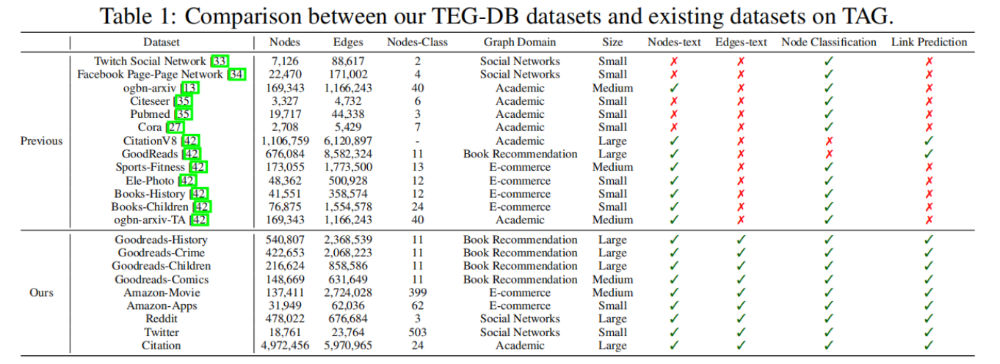

<p align='center'>
  
</p>

## Why TEGs instead of TAGs?

Textual-Edge Graphs (TEGs) incorporate textual content on **both nodes and edges**, unlike Text-Attributed Graphs (TAGs) featuring textual information only at the **nodes**. Edge texts are crucial for understanding document meanings and semantic relationships. For instance, as shown below, to understand the knowledge "Planck endorsed the uncertainty and probabilistic nature of quantum mechanics," **citation edge (Book D - Paper E) text information is essential**. This reveals the comprehensive connections and influences among scholarly works, enabling a deeper analysis of document semantics and knowledge networks.


## Overview

Textual-Edge Graphs Datasets and Benchmark (TEG-DB) is a comprehensive and diverse collection of benchmark textual-edge datasets featuring rich textual descriptions on nodes and edges, data loaders, and performance benchmarks for various baseline models,  including pre-trained language models (PLMs), graph neural networks (GNNs), and their combinations. This repository aims to facilitate research in the domain of textual-edge graphs by providing standardized data formats and easy-to-use tools for model evaluation and comparison.

## Features

+ **Unified Data Representation:** All TEG datasets are represented in a unified format. This standardization allows for easy extension of new datasets into our benchmark.
+ **Highly Efficient Pipeline:** TEG-Benchmark is highly integrated with PyTorch Geometric (PyG), leveraging its powerful tools and functionalities. Therefore, its code is concise. Specifically, for each paradigm, we provide a small `.py` file with a summary of all relevant models and a `.ssh` file  to run all baselines in one click.
+ **Comprehensive Benchmark and Analysis:** We conduct extensive benchmark experiments and perform a comprehensive analysis of TEG-based  methods, delving deep into various aspects such as the impact of different models, the effect of embeddings generated by Pre-trained Language Models (PLMs) of various scales, and the influence of different domain datasets. The statistics of our TEG datasets are as follows:

<p align='center'>
  
</p>

## Datasets

Please click [here](https://huggingface.co/datasets/ZhuofengLi/TEG-Datasets) to  find the TEG datasets we upload!

We have constructed **9 comprehensive and representative TEG datasets (we will continue to expand)**. These datasets cover domains including Book Recommendation, E-commerce, Academic, and Social networks. They vary in size, ranging from small to large. Each dataset contains rich raw text data on both nodes and edges, providing a diverse range of information for analysis and modeling purposes.

<p align='center'>
  
</p>

TEG-DB is an ongoing effort, and we are planning to increase our coverage in the future.

## Our experiments

Please check the experimental results and analysis from our [paper](https://arxiv.org/abs/2406.10310).

## Star and Cite

Please star our repo 🌟 and cite our [paper](https://arxiv.org/abs/2406.10310) if you feel useful. Feel free to [email](mailto:zhuofengli12345@gmail.com) us (zhuofengli12345@gmail.com) if you have any questions.

```
@misc{li2024tegdb,
      title={TEG-DB: A Comprehensive Dataset and Benchmark of Textual-Edge Graphs}, 
      author={Zhuofeng Li and Zixing Gou and Xiangnan Zhang and Zhongyuan Liu and Sirui Li and Yuntong Hu and Chen Ling and Zheng Zhang and Liang Zhao},
      year={2024},
      eprint={2406.10310},
      archivePrefix={arXiv},
      primaryClass={id='cs.CL' full_name='Computation and Language' is_active=True alt_name='cmp-lg' in_archive='cs' is_general=False description='Covers natural language processing. Roughly includes material in ACM Subject Class I.2.7. Note that work on artificial languages (programming languages, logics, formal systems) that does not explicitly address natural-language issues broadly construed (natural-language processing, computational linguistics, speech, text retrieval, etc.) is not appropriate for this area.'}
}
```

## Requirements

+ pyg=2.5.2

You can quickly install the corresponding dependencies,

```bash
conda env create -f environment.yml
```

## Package Usage

The `TEG` folder in the project is designated for storing data preprocessing code to ensure data output in `PyG Data` format. The `example` folder is intended for housing all baseline models. Within it, the `linkproppred` and `nodeproppred` subfolders represent edge-level and node-level tasks, respectively. In the next level of directories, we organize the training code by using folders named after different domain datasets. TODO: dict structure img

Below we will take the `children` dataset in the `goodreads` folder as an example to show how to use our benchmark.

#### Datasets setup

You can go to the [Huggingface TEG-Benchmark](https://huggingface.co/datasets/ZhuofengLi/TEG-Datasets) to find the datasets we upload! In each dataset folder, you can find the `.json` file (the text attribute of the dataset) in `raw` folder, `.npy` file (text embedding we extract from the PLM) in `emb` folder. Please copy thses files directly in `goodreads/children` folder!

```bash
cd example/linkproppred/goodreads/children

cd raw

# copy `.json` files to `raw`

cd emb

# copy `.npy` files to `emb` 
```

#### GNN for link prediction

```bash
cd example/linkproppred/goodreads

# Run the edge_aware_gnn.py script
python edge_aware_gnn.py --data_type children --emb_type Bert --model_type GraphTransformer

# Run all baseline methods
# bash run_all.sh
```

#### GNN for node classification

Copy the children dataset and embeddings into the `example/nodeproppred/goodreads/children` directory, as we did before (the same dataset and embeddings used for link prediction are also used for node classification).

```bash
cd example/nodeproppred/goodreads

# Run the edge_aware_gnn.py script
python edge_aware_gnn.py --data_type children --emb_type Bert --model_type GraphTransformer

# Run all baseline methods
# bash run_all.sh
```

Here are explanations of some important args,

```bash
--data_type: "the name of dataset"
--emb_type: "embedding type"
--model_type: "model type"
```


## Reference

Please read the following materials carefully to set up your dataset!

+ [pyg graph dataset](https://pytorch-geometric.readthedocs.io/en/latest/notes/create_dataset.html)
+ [ogbn-mag HeteroData example](https://pytorch-geometric.readthedocs.io/en/latest/_modules/torch_geometric/datasets/ogb_mag.html)
+ [Heterogeneous Graph Learning](https://pytorch-geometric.readthedocs.io/en/latest/notes/heterogeneous.html)
+ [Link Prediction on Heterogeneous Graphs with PyG](https://medium.com/@pytorch_geometric/link-prediction-on-heterogeneous-graphs-with-pyg-6d5c29677c70)
