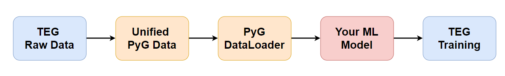

<p align='center'>
  
</p>

## Overview

TAG-Benchmark is a comprehensive collection of public text-attributed graph (TAG) datasets, data loaders, and performance benchmarks for various baseline models, including GNN-based and LLM-based approaches. This repository aims to facilitate research in the domain of text-attributed graphs by providing standardized data formats and easy-to-use tools for model evaluation and comparison.

## Features

+ **Unified Data Representation:** All TAG datasets are represented in a unified format, supporting both homogeneous and heterogeneous data structures. This standardization allows for easy extension of new datasets into our benchmark.
+ **Great Flexibility and User-Friendliness:** TAG-Benchmark is highly integrated with PyTorch Geometric (PyG), leveraging its powerful tools and functionalities. Therefore, its code is concise. For example, for GNN-based methods, we only have one training file (named `edge_aware_gnn.py`) containing a small amount of code for each dataset within each domain. This saves you significant time in cleaning and preparing your codes.
+ **Highly Efficient Pipeline:** We provide bash scripts to run all baseline models. This automation simplifies the process of benchmarking and model evaluation.

<p align='center'>
  
</p>

## Datasets

We have constructed seven comprehensive and representative TAG datasets (we will continue to expand). These datasets cover domains including Book Recommendation, E-commerce, Academic, and Social-network. They vary in size, ranging from small to large. Each dataset contains rich raw text data on both nodes and edges, providing a diverse range of information for analysis and modeling purposes. For statistics of these TAG datasets, please click [here](). # TODO: data table and picture

<p align='center'>
  
</p>

TAG-Benchmark is an on-going effort, and we are planning to increase our coverage in the future.

## Requirements

+ pyg=2.5.2

You can quickly install the corresponding dependencies,

```bash
conda env create -f environment.yml
```

## Package Usage

The `TAG` folder in the project is designated for storing data preprocessing code to ensure data output in `PyG Data` format. The `example` folder is intended for housing all baseline models. Within it, the `linkproppred` and `nodeproppred` subfolders represent edge-level and node-level tasks, respectively. In the next level of directories, we organize the training code by using folders named after different domain datasets. TODO: dict structure img

Below we will take the `children` dataset in the `goodreads` folder as an example to show how to use our benchmark.

#### Datasets setup

You can go to the [TAG-Benchmark]() (TODO) to find the datasets we upload! In each dataset folder, you can find the `.json` file (the text attribute of the dataset) in `raw` folder, `.npy` file (text embedding we extract from the PLM) in `emb` folder. Please copy thses files directly in `goodreads/children` folder!

```bash
cd example/linkproppred/goodreads/children

cd raw

# copy `.json` files to `raw`

cd emb

# copy `.npy` files to `emb` 
```

#### GNN for link prediction

```bash
cd example/linkproppred/goodreads

# Run the edge_aware_gnn.py script
python edge_aware_gnn.py --data_type children --emb_type Bert --model_type GraphTransformer

# Run all baseline methods
# bash run_all.sh
```

#### GNN for node classification

Copy the children dataset and embeddings into the `example/nodeproppred/goodreads/children` directory, as we did before (the same dataset and embeddings used for link prediction are also used for node classification).

```bash
cd example/nodeproppred/goodreads

# Run the edge_aware_gnn.py script
python edge_aware_gnn.py --data_type children --emb_type Bert --model_type GraphTransformer

# Run all baseline methods
# bash run_all.sh
```

Here are explanations of some important args,

```bash
--data_type: "the name of dataset"
--emb_type: "embedding type"
--model_type: "model type"
```

## Our experiments

## Reference

Please read the following materials carefully to set up your dataset!

+ [pyg graph dataset](https://pytorch-geometric.readthedocs.io/en/latest/notes/create_dataset.html)
+ [ogbn-mag HeteroData example](https://pytorch-geometric.readthedocs.io/en/latest/_modules/torch_geometric/datasets/ogb_mag.html)
+ [Heterogeneous Graph Learning](https://pytorch-geometric.readthedocs.io/en/latest/notes/heterogeneous.html)
+ [Link Prediction on Heterogeneous Graphs with PyG](https://medium.com/@pytorch_geometric/link-prediction-on-heterogeneous-graphs-with-pyg-6d5c29677c70)
